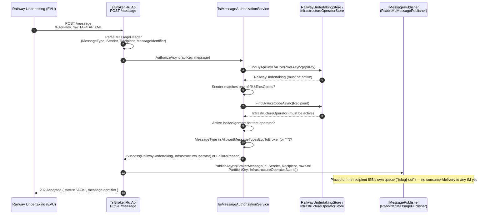
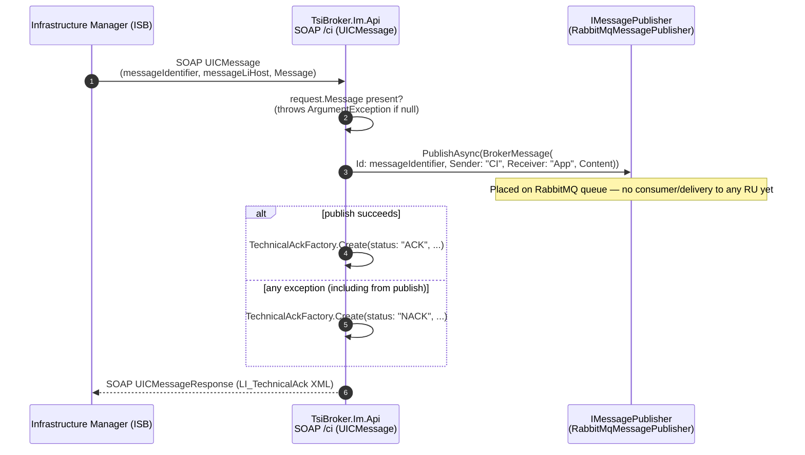
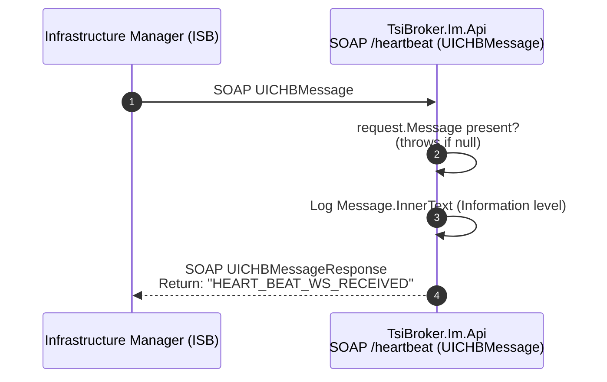

# Business Flow

TsiBroker relays TAF/TAP-TSI messages between Railway Undertakings (RU/EVU) and Infrastructure Managers (IM/ISB). This page documents what each ingestion path actually does today, and — just as importantly — where the flow currently stops.

> **Status: relay not fully implemented yet.** Both ingestion paths (RU→broker via REST, IM→broker via SOAP) validate/authorize the incoming message, wrap it into a `BrokerMessage`, and call `IMessagePublisher.PublishAsync`. `TsiBroker.Ru.Api` and `TsiBroker.Im.Api` register `RabbitMqMessagePublisher` (`TsiBroker.Core/Messaging/RabbitMqMessagePublisher.cs`), which publishes the raw XML `Content` as a persistent message on RabbitMQ's default exchange. The RU→broker flow sets `BrokerMessage.PartitionKey` to the message's recipient `InfrastructureOperator`'s `Name` (resolved via the RICS code in the message's `Recipient`), which routes each Infrastrukturbetreiber's inbound traffic to its own queue (`{slug-of-name}-out`, e.g. `db-netz-out`) so that one operator's messages are never held up by another operator's — see [[Backend-Best-Practices]] §5 for the full per-partition/retry/dead-letter design. The IM→broker (CI) flow doesn't resolve a specific IM/RU yet (see gap #2 below), so it still falls back to the single shared `RabbitMqOptions.QueueName` (default `tsi-messages`). Connection details (`HostName`, `Port`, `UseTls`, `VirtualHost`, `UserName`, `Password`, `QueueName`, `MaxDeliveryAttempts`, `RetryDelay`) are bound from the `RabbitMq` configuration section, meant to be overridden per environment via env vars (e.g. `RabbitMq__HostName`, `RabbitMq__UserName`) — see [[Backend-Best-Practices]] §5. `DebugMessagePublisher` (log-only, no-op) still exists as an alternative implementation but is no longer wired up by default. What's still missing: no consumer reads the queues and forwards messages onward — to an RU's `SystemUrl` (if the receiver is an RU) or to the appropriate IM SOAP endpoint (if the receiver is an IM). So today a message posted by an RU is authorized and placed on the recipient Infrastrukturbetreiber's queue, but never actually delivered to any IM, and vice versa.

---

## Flow 1: RU → Broker (Common Interface / TAF-TAP message)

Implementation: `src/TsiBroker.Ru.Api/Messages/TsiMessageEndpoints.cs`, `IncomingTsiMessage.cs`, `TsiMessageAuthorizationService.cs`.

### Authorization checks (in order)

`TsiMessageAuthorizationService.AuthorizeAsync` fails fast on the first unmet condition:

1. **`InvalidApiKey`** — no active `RailwayUndertaking` found for the `X-Api-Key` header → `401`
2. **`SenderMismatch`** — the message's `Sender` doesn't match (case-insensitively) any of the RU's `RicsCodes` → `403`
3. **`UnknownRecipient`** — no active `InfrastructureOperator` found for the message's `Recipient` RICS code → `400`
4. **`NoIsbAssignment`** — the RU has no active `IsbAssignment` for that operator → `403`
5. **`MessageTypeNotAllowed`** — the message's `MessageType` isn't in the assignment's `AllowedMessageTypesEvuToBroker` and the assignment doesn't allow `"*"` → `403`

Each failure maps to an RFC 7807 `Results.Problem` response with a tailored title/detail/status. On success, a `BrokerMessage(Id: MessageIdentifier, Sender, Receiver: Recipient, Content: rawXml, PartitionKey: InfrastructureOperator.Name)` is published — the `PartitionKey` is what routes it to the recipient ISB's own queue rather than a shared one (see [[Backend-Best-Practices]] §5).

There is no corresponding "broker → RU" delivery endpoint (push or poll) anywhere — an RU can only push messages in, not receive them back through this API. See [[External-API-Guide]] for the RU-facing contract in detail.

---

## Flow 2: IM → Broker (Common Interface, SOAP)

Implementation: `src/TsiBroker.Im.Api/CI/CommonInterfaceMessageService.cs`, `TechnicalAckFactory.cs`.

**Known gap:** unlike the RU-side flow, `Sender`/`Receiver` on the `BrokerMessage` built here are the hardcoded literals `"CI"` / `"App"`, not the actual originating IM or destination RU derived from RICS codes or `messageLiHost`. There is no authorization check equivalent to `TsiMessageAuthorizationService` on this path, and the SOAP endpoint itself has no authentication configured (`BasicHttpBinding` with `BasicHttpSecurityMode.Transport` — HTTPS transport only, no message-level security or client identification). This looks like a placeholder pending the same RICS-code-based routing the RU side already has.

---

## Flow 3: IM → Broker (Heartbeat, SOAP)

Implementation: `src/TsiBroker.Im.Api/Heartbeat/HeartbeatMessageService.cs`.

Heartbeat is a pure liveness echo — it has **no** `IMessagePublisher` dependency at all, so heartbeat traffic never becomes a `BrokerMessage` and is never published, unlike Common Interface traffic. This is a deliberate difference in scope (heartbeats aren't business messages), not a bug, but it's worth knowing when reasoning about "does the broker see everything."

---

## What's Missing for End-to-End Relay

To go from "ingest and queue" to an actual working broker, the following pieces don't exist yet in the codebase:

1. A real handler behind the per-Infrastrukturbetreiber queue consumption that actually forwards messages — to an RU's `SystemUrl` (if the receiver is an RU) or to the appropriate IM SOAP endpoint (if the receiver is an IM). `TsiBroker.ApiService`'s `InfrastructureOperatorConsumerCoordinator` already starts/stops an ordering-preserving, retrying, dead-lettering `IMessageConsumer.StartPartitionAsync` loop per operator in sync with `InfrastructureOperatorStore` (create/activate/deactivate/rename/delete, plus a startup reconciliation — see [[Backend-Best-Practices]] §5), but the handler it passes in, `HandleMessageAsync`, is still just a logging placeholder — it never actually calls out to anything.
2. Real `Sender`/`Receiver` resolution on the IM→broker (CI) path, based on RICS codes rather than the current hardcoded `"CI"`/`"App"` literals
3. An authorization step on the IM→broker path equivalent to `TsiMessageAuthorizationService` on the RU side
4. A decision on whether/how Heartbeat should participate in the broker's message flow at all

## WhoAmI: Self-Service Discovery

`GET /whoami` on `TsiBroker.Ru.Api` (`src/TsiBroker.Ru.Api/WhoAmI/`) lets an RU check its own authorization state without submitting a real message. Given a valid, active `X-Api-Key`, it returns (as XML) the RU's **active** `IsbAssignment`s joined with the matching **active** `InfrastructureOperator`s, each showing the allowed message-type lists in both directions. An invalid or missing key returns an "unknown" response rather than an error — this endpoint doesn't reject unauthenticated calls, it just tells them nothing. See [[External-API-Guide]] for the response shape.
