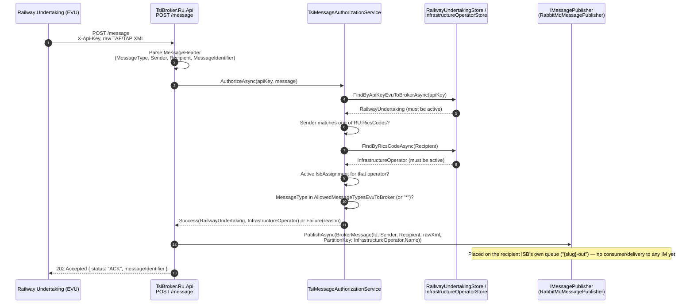
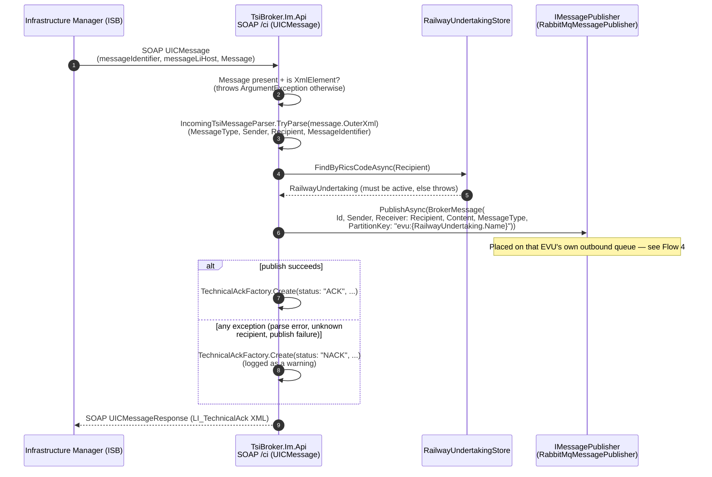
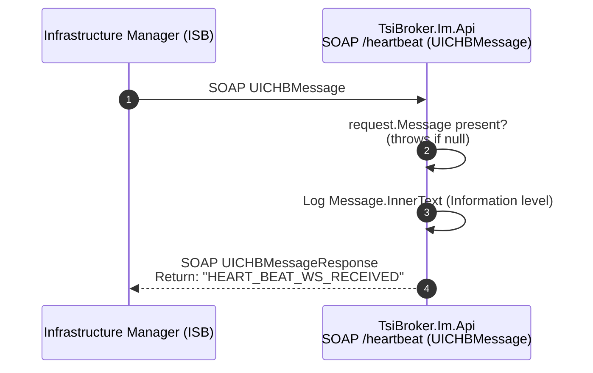
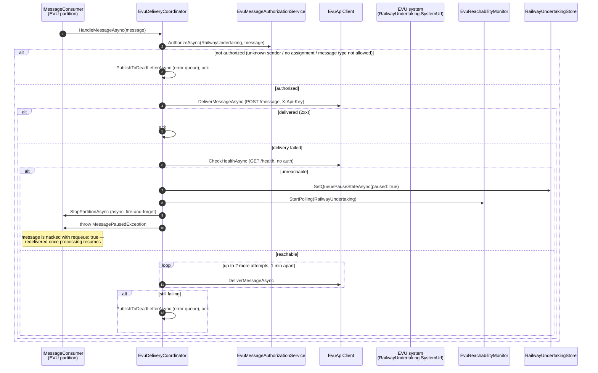

# Business Flow

TsiBroker relays TAF/TAP-TSI messages between Railway Undertakings (RU/EVU) and Infrastructure Managers (IM/ISB). This page documents what each ingestion path actually does today, and — just as importantly — where the flow currently stops.

Both ingestion paths (RU→broker via REST, IM→broker via SOAP) validate/authorize the incoming message, wrap it into a `BrokerMessage`, and call `IMessagePublisher.PublishAsync`. `TsiBroker.Ru.Api` and `TsiBroker.Im.Api` register `RabbitMqMessagePublisher` (`TsiBroker.Core/Messaging/RabbitMqMessagePublisher.cs`), which publishes the raw XML `Content` as a persistent message on RabbitMQ's default exchange. The RU→broker flow sets `BrokerMessage.PartitionKey` to the message's recipient `InfrastructureOperator`'s `Name` (resolved via the RICS code in the message's `Recipient`), which routes each Infrastrukturbetreiber's inbound traffic to its own queue (`{slug-of-name}-out`, e.g. `db-netz-out`). The IM→broker (CI) flow now resolves the recipient `RailwayUndertaking` the same way (via the message's `Recipient` RICS code) and sets `PartitionKey` to `evu:{RailwayUndertaking.Name}` — prefixed so this direction's per-EVU queues never collide with the per-ISB queues the RU→broker direction uses — see [[Backend-Best-Practices]] §5 for the full per-partition/retry/dead-letter design. Connection details (`HostName`, `Port`, `UseTls`, `VirtualHost`, `UserName`, `Password`, `QueueName`, `MaxDeliveryAttempts`, `RetryDelay`) are bound from the `RabbitMq` configuration section, meant to be overridden per environment via env vars (e.g. `RabbitMq__HostName`, `RabbitMq__UserName`) — see [[Backend-Best-Practices]] §5. `DebugMessagePublisher` (log-only, no-op) still exists as an alternative implementation but is no longer wired up by default.

The **IM→RU direction is now fully relayed**: `TsiBroker.ApiService`'s `EvuDeliveryCoordinator` consumes each EVU's queue, authorizes the message against `AllowedMessageTypesBrokerToEvu`, and delivers it to the EVU's own `SystemUrl` via `POST /message` — see Flow 4 below. The **RU→IM direction is still unimplemented**: a message posted by an RU is authorized and placed on the recipient Infrastrukturbetreiber's queue, but nothing yet forwards it on to the IM's SOAP endpoint (see gap #1 below).

---

## Flow 1: RU → Broker (Common Interface / TAF-TAP message)

Implementation: `src/TsiBroker.Ru.Api/Messages/TsiMessageEndpoints.cs`, `IncomingTsiMessage.cs`, `TsiMessageAuthorizationService.cs`.

### Authorization checks (in order)

`TsiMessageAuthorizationService.AuthorizeAsync` fails fast on the first unmet condition:

1. **`InvalidApiKey`** — no active `RailwayUndertaking` found for the `X-Api-Key` header → `401`
2. **`SenderMismatch`** — the message's `Sender` doesn't match (case-insensitively) any of the RU's `RicsCodes` → `403`
3. **`UnknownRecipient`** — no active `InfrastructureOperator` found for the message's `Recipient` RICS code → `400`
4. **`NoIsbAssignment`** — the RU has no active `IsbAssignment` for that operator → `403`
5. **`MessageTypeNotAllowed`** — the message's `MessageType` isn't in the assignment's `AllowedMessageTypesEvuToBroker` and the assignment doesn't allow `"*"` → `403`

Each failure maps to an RFC 7807 `Results.Problem` response with a tailored title/detail/status. On success, a `BrokerMessage(Id: MessageIdentifier, Sender, Receiver: Recipient, Content: rawXml, PartitionKey: InfrastructureOperator.Name)` is published — the `PartitionKey` is what routes it to the recipient ISB's own queue rather than a shared one (see [[Backend-Best-Practices]] §5).

There is no corresponding "broker → RU" delivery endpoint (push or poll) anywhere — an RU can only push messages in, not receive them back through this API. See [[External-API-Guide]] for the RU-facing contract in detail.

---

## Flow 2: IM → Broker (Common Interface, SOAP)

Implementation: `src/TsiBroker.Im.Api/CI/CommonInterfaceMessageService.cs`, `TechnicalAckFactory.cs`, `IncomingTsiMessageParser` (`TsiBroker.Core/Messaging/IncomingTsiMessage.cs` — shared with the RU→broker path).

**Remaining gap:** there is still no authorization check equivalent to `TsiMessageAuthorizationService` on this path (any IM can address any active EVU, with no ISB-side allow-list), and the SOAP endpoint itself has no authentication configured (`BasicHttpBinding` with `BasicHttpSecurityMode.Transport` — HTTPS transport only, no message-level security or client identification).

---

## Flow 3: IM → Broker (Heartbeat, SOAP)

Implementation: `src/TsiBroker.Im.Api/Heartbeat/HeartbeatMessageService.cs`.

Heartbeat is a pure liveness echo — it has **no** `IMessagePublisher` dependency at all, so heartbeat traffic never becomes a `BrokerMessage` and is never published, unlike Common Interface traffic. This is a deliberate difference in scope (heartbeats aren't business messages), not a bug, but it's worth knowing when reasoning about "does the broker see everything."

---

## Flow 4: Broker → RU (message delivery, retry/pause)

Implementation: `src/TsiBroker.ApiService/RailwayUndertakings/EvuDeliveryCoordinator.cs`, `EvuMessageAuthorizationService.cs`, `EvuReachabilityMonitor.cs`; `src/TsiBroker.Core/RailwayUndertakings/EvuApiClient.cs`; `src/TsiBroker.Core/Messaging/MessagePausedException.cs`.

### Authorization (broker → EVU)

`EvuMessageAuthorizationService.AuthorizeAsync` mirrors `TsiMessageAuthorizationService` for the opposite direction: resolves the sending `InfrastructureOperator` via the message's `Sender` RICS code, finds the matching active `IsbAssignment` on the `RailwayUndertaking`, and checks the message's `MessageType` against `AllowedMessageTypesBrokerToEvu` (or `"*"`). A rejected message is routed straight to the EVU's error queue — it's a configuration problem, not a transient delivery failure, so it isn't retried.

### The "error queue" is the partition's existing dead-letter queue

There's no separate error-queue concept: `IMessagePublisher.PublishToDeadLetterAsync(partitionKey, message)` publishes directly into that partition's `{queue}.dead-letter` queue (the same one `RabbitMqMessageConsumer` already uses when a handler keeps throwing past `MaxDeliveryAttempts` — see [[Backend-Best-Practices]] §5), so one queue per EVU is where operators look for anything that couldn't be delivered, regardless of why.

### Pause / resume

An EVU whose `/health` check fails has its outbound queue **paused** (`RailwayUndertaking.IsQueuePaused`, visible in the UI's Queues page) rather than retried — `EvuReachabilityMonitor` polls `/health` on a backoff schedule (1, 1, 1, 5, 5, 5, 10, 10, 10, 60, 60, 60 minutes, then every 60 minutes indefinitely; the step is persisted as `PauseBackoffStep` so a process restart continues the schedule instead of resetting it) and resumes the partition on the first successful check. Processing also resumes if: an admin clicks "resume now" in the UI (`POST /api/railway-undertakings/{id}/resume-queue`), or the EVU itself makes an authenticated request to `TsiBroker.Ru.Api` (`GET /whoami` or `POST /message`) — both just clear `IsQueuePaused` in the shared store; since `TsiBroker.Ru.Api` runs in a separate process from the coordinator, `EvuReachabilityMonitor`'s poll loop notices the externally-cleared flag within `ExternalResumeCheckInterval` (10s) rather than waiting out the rest of the current backoff interval.

## What's Missing for End-to-End Relay

1. A real handler behind the per-Infrastrukturbetreiber queue consumption that forwards RU→broker messages onward to the appropriate IM SOAP endpoint. `InfrastructureOperatorConsumerCoordinator`'s `HandleMessageAsync` is still just a logging placeholder — the broker→RU direction (Flow 4 above) now has real delivery logic, but this direction doesn't yet.
2. An authorization step on the IM→broker path equivalent to `TsiMessageAuthorizationService`/`EvuMessageAuthorizationService` (any IM can currently address any active EVU)
3. A decision on whether/how Heartbeat should participate in the broker's message flow at all

## WhoAmI: Self-Service Discovery

`GET /whoami` on `TsiBroker.Ru.Api` (`src/TsiBroker.Ru.Api/WhoAmI/`) lets an RU check its own authorization state without submitting a real message. Given a valid, active `X-Api-Key`, it returns (as XML) the RU's **active** `IsbAssignment`s joined with the matching **active** `InfrastructureOperator`s, each showing the allowed message-type lists in both directions. An invalid or missing key returns an "unknown" response rather than an error — this endpoint doesn't reject unauthenticated calls, it just tells them nothing. See [[External-API-Guide]] for the response shape.
