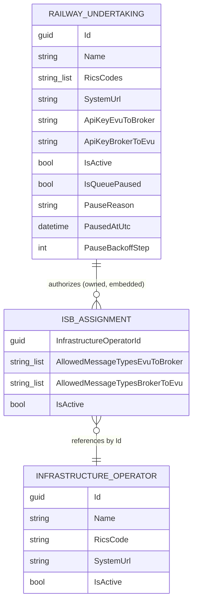

# Data Model

TsiBroker has two persisted entities, both stored as JSON files (no database — see [[Architecture]]). There is no `RailwayUndertaking` ↔ `InfrastructureOperator` link table; the relationship is embedded directly on `RailwayUndertaking` as a list of `IsbAssignment`.



## Entities

### InfrastructureOperator

`src/TsiBroker.Core/InfrastructureOperators/InfrastructureOperator.cs` — represents an Infrastructure Manager (IM/ISB).

```csharp
public class InfrastructureOperator
{
    public Guid Id { get; set; }
    public required string Name { get; set; }
    public required string RicsCode { get; set; }
    public required string SystemUrl { get; set; }
    public bool IsActive { get; set; } = true;
}
```

- `RicsCode` — the operator's RICS code, used to resolve the `Recipient` on an incoming RU message (`RailwayUndertakingStore`/`InfrastructureOperatorStore.FindByRicsCodeAsync`, case-insensitive)
- `SystemUrl` — the IM's own system endpoint; currently stored but **not yet used** by any relay logic (see [[Business-Flow]])
- Stored in `App_Data/infrastructure-operators.json` via `InfrastructureOperatorStore`

### RailwayUndertaking

`src/TsiBroker.Core/RailwayUndertakings/RailwayUndertaking.cs` — represents a Railway Undertaking (RU/EVU).

```csharp
public class RailwayUndertaking
{
    public Guid Id { get; set; }
    public required string Name { get; set; }
    public required List<string> RicsCodes { get; set; }
    public required string SystemUrl { get; set; }
    public string ApiKeyEvuToBroker { get; set; } = string.Empty;
    public string ApiKeyBrokerToEvu { get; set; } = string.Empty;
    public List<IsbAssignment> InfrastructureOperatorAssignments { get; set; } = [];
    public bool IsActive { get; set; } = true;

    public bool IsQueuePaused { get; set; }
    public string? PauseReason { get; set; }
    public DateTimeOffset? PausedAtUtc { get; set; }
    public int PauseBackoffStep { get; set; }
}
```

- `RicsCodes` — a list, not a single code: an RU can operate under multiple RICS codes. The `Sender` on an incoming message must match one of these (case-insensitive)
- `ApiKeyEvuToBroker` — the key the RU presents via `X-Api-Key` when calling `POST /message` on `TsiBroker.Ru.Api` (looked up via `FindByApiKeyEvuToBrokerAsync`, exact/ordinal match)
- `ApiKeyBrokerToEvu` — generated and stored the same way, used to authenticate the broker's own outbound calls to the EVU (`EvuApiClient`)
- Both keys are generated by `RailwayUndertakingStore.GenerateApiKey()` — a cryptographically random 40-character string (`RandomNumberGenerator.GetString`) drawn from an alphanumeric-plus-safe-symbols alphabet that deliberately excludes characters needing escaping in JSON/XML (`" ' < > & \` and whitespace)
- `IsQueuePaused`/`PauseReason`/`PausedAtUtc`/`PauseBackoffStep` — whether broker→EVU outbound delivery is currently paused because the EVU's system was found unreachable, independent of `IsActive` (which governs inbound authentication instead). Set/cleared via `RailwayUndertakingStore.SetQueuePauseStateAsync`; `PauseBackoffStep` is the index into `EvuReachabilityMonitor`'s backoff schedule, persisted so a process restart continues the schedule instead of resetting it. See [[Business-Flow]] Flow 4.
- Stored in `App_Data/railway-undertakings.json` via `RailwayUndertakingStore`

### IsbAssignment (embedded, not a top-level entity)

`src/TsiBroker.Core/RailwayUndertakings/RailwayUndertaking.cs` (same file) — authorizes message exchange between one RU and one `InfrastructureOperator`.

```csharp
public class IsbAssignment
{
    public required Guid InfrastructureOperatorId { get; set; }
    public List<string> AllowedMessageTypesEvuToBroker { get; set; } = [];
    public List<string> AllowedMessageTypesBrokerToEvu { get; set; } = [];
    public bool IsActive { get; set; } = true;
}
```

- Lives inside `RailwayUndertaking.InfrastructureOperatorAssignments` — there is no separate JSON file or store for it
- `AllowedMessageTypesEvuToBroker` / `AllowedMessageTypesBrokerToEvu` are message-type strings (e.g. specific TAF/TAP message types); the literal `"*"` means "all message types allowed" (checked case-insensitively in `TsiMessageAuthorizationService`)
- When an `InfrastructureOperator` is deleted via the admin API, `RailwayUndertakingStore.RemoveInfrastructureOperatorAssignmentsAsync` sweeps every RU and removes any `IsbAssignment` pointing at the deleted operator — this is the only referential-integrity mechanism, run explicitly at the endpoint layer since there's no database to enforce a foreign key

## Messaging Envelope (not persisted)

`BrokerMessage` (`src/TsiBroker.Core/Messaging/BrokerMessage.cs`) is not stored anywhere — it's the transient envelope passed to `IMessagePublisher`:

```csharp
public record BrokerMessage(
    string? Id,
    string Sender,
    string Receiver,
    string Content,
    string? PartitionKey = null,
    string MessageType = "");
```

`Content` carries the raw message payload (typically XML). `PartitionKey` groups messages that must stay in order relative to each other (e.g. the recipient `InfrastructureOperator.Name`, or `evu:{RailwayUndertaking.Name}` for the broker→EVU direction) — messages without one fall back to the publisher/consumer's single default queue. `MessageType` carries the TAF/TAP TSI message type (from `MessageHeader/MessageReference/MessageType`), used to authorize delivery against `IsbAssignment.AllowedMessageTypesEvuToBroker`/`AllowedMessageTypesBrokerToEvu`. See [[Business-Flow]] for how each field is populated on each ingestion path, and [[Backend-Best-Practices]] §5 for the per-partition queueing this enables.

## Storage

| Storage | Entities | File | Rationale |
|---------|----------|------|-----------|
| JSON file | `InfrastructureOperator` | `App_Data/infrastructure-operators.json` | Low record count, single-instance deployment, no need for a database yet |
| JSON file | `RailwayUndertaking` (with embedded `IsbAssignment`s) | `App_Data/railway-undertakings.json` | Same |

Both files are read/written under a per-store `SemaphoreSlim(1, 1)` lock. See [[Architecture]] for the concurrency and scaling caveats of this approach.
